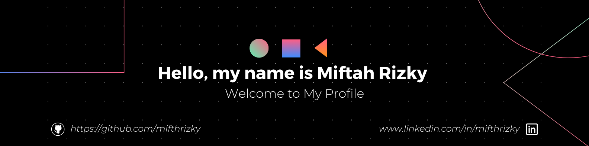

<!--Banner-->


#  Welcome to My Code Universe!


```javascript
const miftahRizky = {
  name: "Miftah Rizky A",
  role: "Full-Stack Developer 🚀 | Data Engineer 📊 | IOT Enthusiast 🤖",
  location: "Indonesia 🇮🇩",
  passions: ["Code", "Open Source", "Tech Blogs"],
  funFact: "I turn coffee ☕ into code"
};
```

---

## 🎯 About Me

I'm a passionate **Full-Stack Developer** crafting elegant solutions with modern technologies. I believe in writing clean code, embracing continuous learning, and contributing to the open-source community.

- 🔧 Building scalable applications with **JavaScript**, **React**, and **Node.js**
- 🌱 Exploring **Python**, **Web3**, and **Cloud Technologies**
- 📚 Sharing knowledge through blogs and contributions
- 💡 Open to collaborations and exciting projects
- ⚡ **Fun fact:** Best code is written after the 3rd coffee! ☕

---

## 💻 Tech Stack & Skills

<div align="center">

### Languages


### Frontend


### Backend & Databases


### Tools & Platforms


</div>

---

## 📈 GitHub Statistics

<div align="center">

<a href="https://github.com/DenverCoder1/github-readme-streak-stats">
  
</a>

</div>

---

## 📊 Contribution Graph

<picture>
  <source media="(prefers-color-scheme: dark)" srcset="https://raw.githubusercontent.com/mifthrizky/mifthrizky/output/github-snake-dark.svg" />
  <source media="(prefers-color-scheme: light)" srcset="https://raw.githubusercontent.com/mifthrizky/mifthrizky/output/github-snake.svg" />
  
</picture>

---

## 🤝 Let's Connect!

<div align="center">

I'm always interested in hearing about new projects, creative ideas, or opportunities to be part of your visions.

[](mailto:miftahrizky249@gmail.com)
[](https://www.linkedin.com/in/mifthrizky/)
[](https://miftah-rizky.vercel.app/)
[](https://www.instagram.com/mifthrizky/)

</div>

---

<div align="center">

### ⭐ If you find my work interesting, don't forget to star my repositories!

**Thanks for visiting my profile!** 👋

```
Let's build something amazing together! 🚀
```

</div>

<p align="center">
  
</p>

<p align="center">
  
</p>
